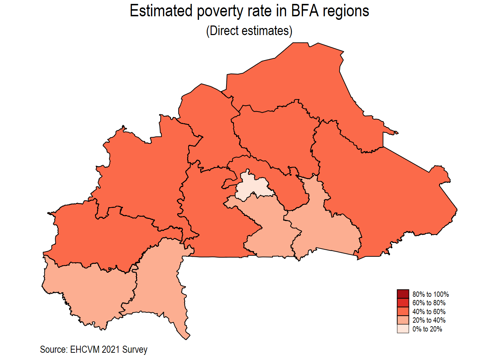
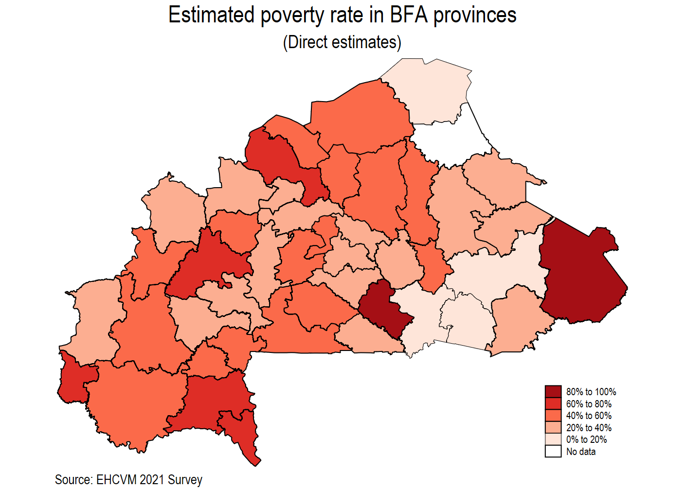
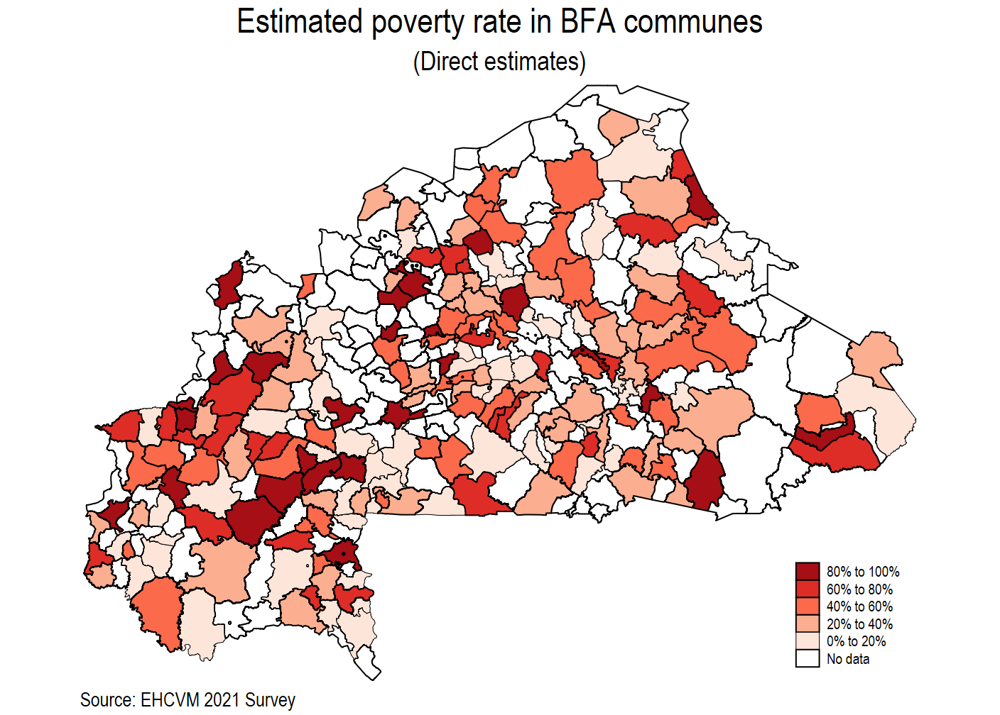

```{r echo=FALSE, message=F, warning=F, message=F, warning=F}
library(tidyverse)
library(flextable)
library(officer)
library(haven)
library(dplyr)
```


```{r echo=FALSE, message=F, warning=F}
# Dependencies : dplyr, flextable, officer
# source link : https://www.r-bloggers.com/2021/11/publication-ready-tables-with-flextable-and-own-theme-in-r/
customtab_defaults <- function(){
  set_flextable_defaults(font.family = "Calibri",
                         font.size = 10,
                         border.color = "black")
}
FitFlextableToPage <- function(ft, pgwidth = 7){
  
  ft_out <- ft %>% autofit()
  
  ft_out <- width(ft_out, width = dim(ft_out)$widths*pgwidth /(flextable_dim(ft_out)$widths))
  return(ft_out)
}
custom_tab <- function(df, header, footer){
  flextable(df) %>%
    add_header_lines(header) %>%
    add_footer_lines(footer) %>%
    bold(i = 1, part = "header") %>%
    hline_top(part = "header",
              border = fp_border(color = "green",
                                 width = 3,
                                 style = "solid")) %>%
    hline(i = 1,
          part = "header",
          border = fp_border(color = "black",
                             width = 0.25,
                             style = "solid")) %>%
    hline_top(part = "body",
              border = fp_border(color = "black",
                                 width = 0.25,
                                 style = "solid")) %>%
    hline_bottom(part = "body",
                 border = fp_border(color = "black",
                                    width = 0.25,
                                    style = "solid")) %>%
    hline_bottom(part = "footer",
                 border = fp_border(color = "black",
                                    width = 0.25,
                                    style = "solid")) %>%
    border_inner_h(part = "body",
                   border = fp_border(color = "black",
                                      width = 0.25,
                                      style = "dotted")) %>%
    autofit(part = "body") %>%
    bg(part = "body", bg = "#f5f5f5") %>%
    align(part = "all", align = "center") %>%
    align(j = 1, part = "all", align = "left")
}
```


**Estimates and maps**

Direct estimates where the Survey Household is representative. Direct estimates do not use auxiliary data by definition; thus, we just use the poverty dummy indicator from the EHCVM-2021 to calculate it. Direct estimates are calculated solely using the household survey data, that is why you will find some communes  with missing values in the direct estimate’s tables. The EHCVM-2021 is representative at the national, urban/rural, and regional level. 

##	Direct estimates at the national and urban/rural level.

## Direct  and FH estimates at the first administrative level


```{r echo=FALSE, message=F, warning=F, message=F, warning=F}
library(haven)
direct_and_fh_region <- read_dta("C:/Users/AHema/OneDrive - CGIAR/Desktop/Poverty Mapping/Small area estimation/Burkina Faso/Application of Fay-Herriot Model for Burkina Faso/00.Data/direct_and_fh_region.dta")
#View(direct_and_fh_region)

direct_and_fh_region <- direct_and_fh_region %>% 
  labelled::to_factor()

var_needed = c("region",	"N",	"N_hhsize",	"dir_fgt0",	"dir_fgt0_var",	"fh_fgt0",	"fh_fgt0_se",	"fh_fgt0_cv"
)

var_description = c("Area level (admin 1)", "Sample size (Survey)", "#Households","Direct estimate (FGT0)","Direct estimate Variance","FH estimate","FH estimate Variance","FH estimate CV")

df_admin1 = direct_and_fh_region %>% 
  dplyr::select(var_needed)

df_admin1 = df_admin1 %>% 
  dplyr::mutate(dir_fgt0 = round(dir_fgt0 * 100,4),
                dir_fgt0_var = round(dir_fgt0_var,5),
                fh_fgt0 = round(fh_fgt0 * 100,4),
                fh_fgt0_se = round(fh_fgt0_se,5)) %>% 
  dplyr::filter(!is.na(region))

names(df_admin1) = var_description
```


```{r echo=FALSE, message=F, warning=F, message=F, warning=F}
header <- str_squish(str_remove("Table : Direct  and FH estimates at the regional level", "\n"))
# Set Table footer
footer <- str_squish(str_remove("", "\n"))
# Set custom_tab() defaults
customtab_defaults()
custom_tab(df_admin1, header, footer)
```




## Direct  and FH estimates at the second administrative level





```{r echo=FALSE, message=F, warning=F, message=F, warning=F}
library(haven)
direct_and_fh_region <- read_dta("C:/Users/AHema/OneDrive - CGIAR/Desktop/Poverty Mapping/Small area estimation/Burkina Faso/Application of Fay-Herriot Model for Burkina Faso/00.Data/direct_and_fh_provinces.dta")
#View(direct_and_fh_region)

direct_and_fh_region <- direct_and_fh_region %>% 
  labelled::to_factor()

var_needed = c("region",	"province",	"N",	"N_hhsize",	"dir_fgt0",	"dir_fgt0_var",	"fh_fgt0",	"fh_fgt0_se",	"fh_fgt0_cv"

)

var_description = c("Area level (admin 1)","Area level (admin 2)", "Sample size (Survey)", "#Households","Direct estimate (FGT0)","Direct estimate Variance","FH estimate","FH estimate Variance","FH estimate CV")

df_admin1 = direct_and_fh_region %>% 
  dplyr::select(var_needed)

df_admin1 = df_admin1 %>% 
  dplyr::mutate(dir_fgt0 = round(dir_fgt0 * 100,4),
                dir_fgt0_var = round(dir_fgt0_var,5),
                fh_fgt0 = round(fh_fgt0 * 100,4),
                fh_fgt0_se = round(fh_fgt0_se,5)) %>% 
  dplyr::filter(!is.na(region))

names(df_admin1) = var_description
```


```{r echo=FALSE, message=F, warning=F, message=F, warning=F}
header <- str_squish(str_remove("Table : Direct  and FH estimates at the department level", "\n"))
# Set Table footer
footer <- str_squish(str_remove("", "\n"))
# Set custom_tab() defaults
customtab_defaults()
custom_tab(df_admin1, header, footer)
```


## Direct  and FH estimates at the third administrative level




```{r echo=FALSE, message=F, warning=F, message=F, warning=F}
library(haven)
direct_and_fh_region <- read_dta("C:/Users/AHema/OneDrive - CGIAR/Desktop/Poverty Mapping/Small area estimation/Burkina Faso/Application of Fay-Herriot Model for Burkina Faso/00.Data/direct_and_fh_commune.dta")
#View(direct_and_fh_region)

direct_and_fh_region <- direct_and_fh_region %>% 
  labelled::to_factor()


var_needed = c("adm1_pcode",	"adm2_pcode",	"adm3_pcode",
	"N_hhsize",	"dir_fgt0",	"dir_fgt0_var",	"fh_fgt0",	"fh_fgt0_se",	"fh_fgt0_cv"

)

var_description = c("Area level (admin 1)","Area level (admin 2)", "Area level (admin 3)", "#Households","Direct estimate (FGT0)","Direct estimate Variance","FH estimate","FH estimate Variance","FH estimate CV")

df_admin1 = direct_and_fh_region %>% 
  dplyr::select(var_needed)

df_admin1 = df_admin1 %>% 
  dplyr::mutate(dir_fgt0 = round(dir_fgt0 * 100,4),
                dir_fgt0_var = round(dir_fgt0_var,5),
                fh_fgt0 = round(fh_fgt0 * 100,4),
                fh_fgt0_se = round(fh_fgt0_se,5)) %>% 
  dplyr::filter(adm1_pcode !="")

names(df_admin1) = var_description
```


```{r echo=FALSE, message=F, warning=F, message=F, warning=F}
header <- str_squish(str_remove("Table : Direct  and FH estimates at the communal level", "\n"))
# Set Table footer
footer <- str_squish(str_remove("", "\n"))
# Set custom_tab() defaults
customtab_defaults()
custom_tab(df_admin1, header, footer)
```

