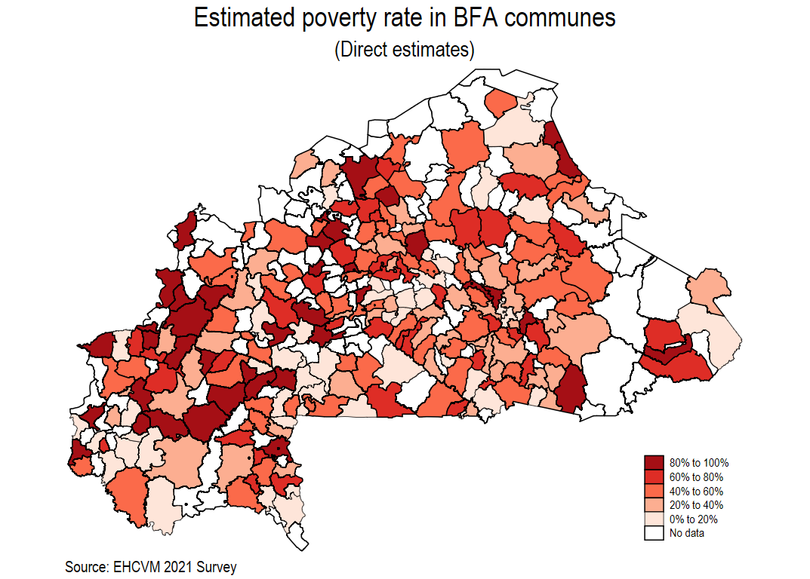

# Application-of-Fay-Herriot-Model-for-Burkina-Faso

## Data

**EHCVM-2021**: 3227 observations for households that cover 13 regions, 44 provinces and 314 communes. 

**ACLED Data** : ACLED data at second administrative level. 

**Climate data**

## Poverty Mapping for Burkina Faso

The machine learning models and direct estimates for poverty headcount (FGT0) at non-representative area levels: region (admin level 1), provinces (admin level 2), and communes (admin level 3) were calculated by using aggregated means from the EHCVM-2021 at the household level (3227 households),the ACLED data and climate data. Direct estimates were also calculated for every geographical level of disaggregation, including the ones where the EHCVM-2021 is representative (national, urban/rural, and regional level).

### Estimates and maps

####  Direct and ML estimates at the administrative level 1 (region). 

{fig-align="center"}

####  Direct and ML estimates at the administrative level 2 (provinces). 

{fig-align="center"}

{fig-align="center"}

####  Direct and ML estimates at the administrative level 3 (communes). 

{fig-align="center"}

{fig-align="center"}

## References

-   Corral, P., Henderson, H., and Segovia, S. (2023) Poverty Mapping in the Age of Machine Learning. <Forthcoming>.

-   Chen, T. and Guestrin, C. (2016). XGBoost: A scalable tree boosting system. In Proceedings of the 22nd ACM SIGKDD International Conference on Knowledge Discovery and Data Mining, pages 785--794.

-   Chi, G., Fang, H., Chatterjee, S., and Blumenstock, J. E. (2022). Microestimates of wealth for all low-and middle-income countries. Proceedings of the National Academy of Sciences, 119(3):1--11.

-   Corral, P., Molina, I., Cojocaru, A., and Segovia, S. (2022). Guidelines to small area estimation for poverty mapping. The World Bank, Washington, DC.

-   Jean, N., Burke, M., Xie, M., Davis, W. M., Lobell, D. B., and Ermon, S. (2016). Combining satellite imagery and machine learning to predict poverty. Science, 353(6301):790--794.

-   Steele, J. E., Sundsøy, P. R., Pezzulo, C., Alegana, V. A., Bird, T. J., Blumenstock, J., Bjelland,J., Engø-Monsen, K., de Montjoye, Y.-A., Iqbal, A. M., Hadiuzzaman, K. N., Lu, X., Wetter, E., Tatem, A. J., and Bengtsson, L. (2017). Mapping poverty using mobile phone and satellite data. Journal of The Royal Society Interface, 14(127):20160690.

-   Lee, K. and Braithwaite, J. (2020). High-resolution poverty maps in sub-Saharan Africa. arXiv preprint arXiv:2009.00544.
